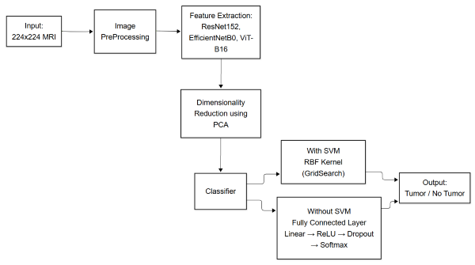

# Brain Tumor Classification from MRI Scans Using Transfer Learning and Hybrid Deep Learning Models

[](https://www.python.org/downloads/)
[](https://pytorch.org/)
[](https://scikit-learn.org/)
[](https://opensource.org/licenses/MIT)

[](https://colab.research.google.com/github/Kumar-coder98/-BRAIN-TUMOR-CLASSIFICATION-FROM-MRI-SCANS-USING-TRANSFER-LEARNING-AND-HYBRID-DEEP-LEARNING-MODELS/blob/main/braintumordetection.ipynb)

This repository contains the official implementation for the research paper, "Brain Tumor Classification from MRI Scans Using Transfer Learning and Hybrid Deep Learning Models." We propose a hybrid framework that integrates deep feature extraction with classical machine learning to achieve state-of-the-art accuracy in detecting brain tumors from MRI scans.

Our best-performing model, a **Vision Transformer (ViT-B16)** combined with **Principal Component Analysis (PCA)** and a **Support Vector Machine (SVM)**, achieved an accuracy of **99.83% - 100%**, demonstrating exceptional robustness and generalization.

## Abstract

Detecting brain tumors from MRI scans is a considerable challenge due to the intricate nature of brain tissues and tumor variability. This research proposes a distinctive methodology that integrates contemporary transfer learning techniques with a hybrid classification framework. It utilizes deep feature extraction from MRI scans through pretrained networks (ResNet152, EfficientNetB0, ViT-B16), followed by PCA for dimensionality reduction and an optimized SVM for final classification. The findings affirm the efficacy of transformer-based architectures in conjunction with classical machine learning methods for medical image classification, positioning this hybrid pipeline as a strong candidate for integration into clinical diagnostic systems.

## Key Features

- **Hybrid Model Architecture**: Combines the strengths of deep learning (for feature extraction) and classical machine learning (for robust classification).
- **State-of-the-Art Performance**: Achieves up to **100% accuracy** with the ViT-B16 + PCA + SVM pipeline.
- **Comparative Analysis**: Evaluates and compares three powerful pretrained models: `ResNet152`, `EfficientNetB0`, and `Vision Transformer (ViT-B16)`.
- **Efficient & Scalable**: Employs PCA to reduce feature dimensionality, mitigating overfitting and improving computational efficiency.
- **Reproducibility**: Includes the complete Python notebook to replicate the experiments and results.

## Project Architecture

The core of our methodology is a hybrid pipeline that leverages the feature extraction capabilities of deep neural networks while using a robust, well-generalizing classifier for the final decision. This approach avoids the need for extensive fine-tuning and is highly effective on limited medical datasets.

The workflow is as follows:

1.  **Input & Preprocessing**: MRI scans are resized to 224x224 pixels and undergo normalization and data augmentation (rotations, flips, color jitter).
2.  **Deep Feature Extraction**: Pretrained models (ResNet152, EfficientNetB0, or ViT-B16) are used to extract high-dimensional feature vectors from the images.
3.  **Dimensionality Reduction**: PCA is applied to reduce the feature vectors, retaining 95-99% of the variance while removing redundancy and noise.
4.  **Classification**: A Support Vector Machine (SVM) with an RBF kernel, optimized using GridSearchCV, performs the final binary classification (Tumor / No Tumor).


*Figure 1: The proposed hybrid methodology pipeline.*

## Performance & Results

We evaluated multiple architectural combinations. The ViT-B16 pipeline consistently demonstrated superior performance, highlighting the power of transformer-based global attention for medical imaging tasks.

### Summary of Model Performance

| S.no | Architecture + Classifier         | Feature Extraction | Optimizer | Dimensionality Reduction | Classifier and Kernel              | Augmentations | Accuracy (%)  |
| :--- | :-------------------------------- | :----------------- | :-------- | :----------------------- | :--------------------------------- | :------------ | :------------ |
| 1    | ResNet152 + SVM + PCA             | `ResNet152`        | —         | PCA 95%                  | SVM (poly, deg=4, C=5, γ=0.1)      | Yes           | 98.54         |
| 2    | ResNet152 + fine-tune + Adam      | `ResNet152`        | Adam      | None                     | FC Softmax                         | Yes           | 99.50         |
| 4    | ResNet152 + SVM + PCA             | `ResNet152`        | —         | PCA 99%                  | SVM (RBF), C=1, γ=auto             | No            | 98.00-98.17   |
| 5    | EfficientNetB0 + PCA + SVM        | `EfficientNetB0`   | —         | PCA 99%                  | SVM (RBF), C=10, γ=0.001           | Yes           | 98.30-99.00   |
| 6    | EfficientNetB0 + SVM (no PCA)     | `EfficientNetB0`   | —         | None                     | SVM (RBF), C=10-500, γ=0.001       | Yes           | 98.60-99.00   |
| 7    | ViT-B16 + fine-tune + AdamW       | `ViT-B16`          | AdamW     | None                     | FC Softmax                         | Yes           | 99.67         |
| **8**  | **ViT-B16 + PCA + SVM**           | **`ViT-B16`**      | **—**     | **PCA 99%**              | **SVM (RBF), GridSearchCV**        | **Yes**       | **99.83-100** |

## Getting Started

Follow these instructions to set up the project and run the experiments on your own machine or on Google Colab.

### Prerequisites

The project is built using Python 3. You will need the following libraries:
- PyTorch
- Torchvision
- Scikit-learn
- Transformers (by Hugging Face)
- Timm
- Tqdm
- Pillow
- Matplotlib

You can install all dependencies using pip:
```bash
pip install torch torchvision scikit-learn transformers timm tqdm pillow matplotlib

